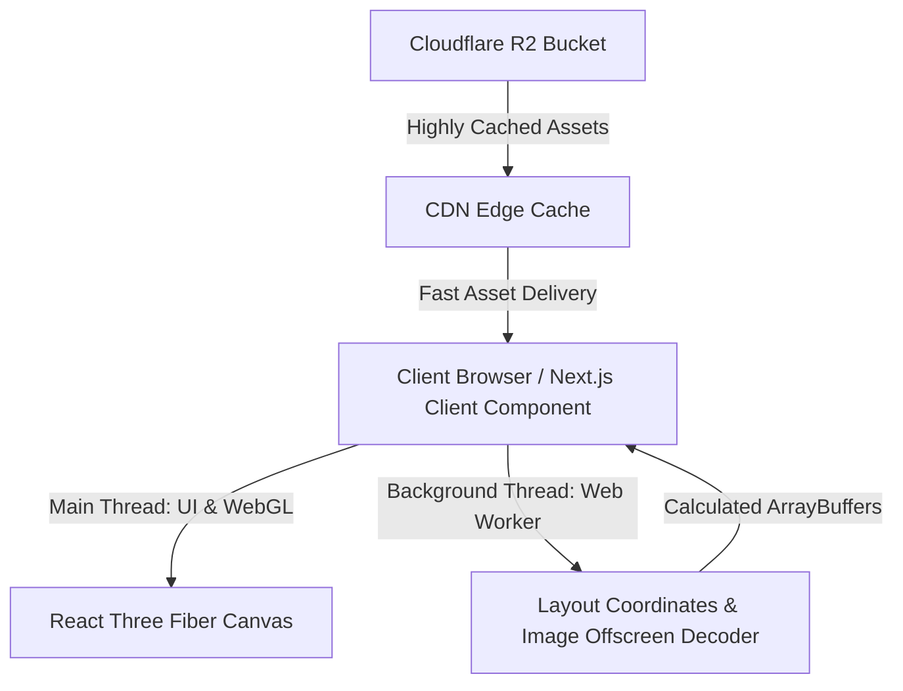

# 3D Wedding Gallery Performance Optimization & Architecture

This document establishes the optimization workflow, performance strategies, and architectural design for the 3D Wedding Photo Gallery. The stack combines Next.js 16 (App Router), React Three Fiber (R3F), Drei, and Cloudflare R2 to deliver a highly interactive, fluid 3D experience across desktop and mobile devices.

---

## 1. Project Context Summary

The gallery operates as an immersive 3D space rendering dynamic photos fetched from Cloudflare R2. It supports six distinct spatial layouts, transitioning between them via a custom `CameraController` and a `DisplayStyleSelector`:

*   **Constellation:** A scattered, star-like network of floating photos connected by faint interactive lines.
*   **Editorial:** A structured grid-like layout inspired by classic wedding magazines.
*   **FilmFlow:** A curved, horizontal filmstrip layout that rolls past the camera.
*   **Orbit:** An interactive cylinder or sphere of photos rotating around the focal point.
*   **Tunnel:** A deep 3D perspective path where photos line the walls.
*   **Stack:** A neat, stacked deck layout where photos are flipped through sequentially.

To maintain 60 FPS on lower-end devices while displaying dozens of high-resolution images, we utilize the optimizations outlined below.

---

## 2. Asset Pipeline Optimizations

Large assets are the primary bottleneck in web-based 3D applications. The asset pipeline is optimized for minimal network overhead and fast GPU uploading.

### Texture Tiering
We implement a three-tiered texture delivery system based on user device and screen context:
1.  **Low-Tier (Thumbnails / Mobile):** Small WebP images (max width/height 512px) for general overview displays.
2.  **Mid-Tier (Default / Standard):** WebP images (max width/height 1024px) with high compression, serving as the standard texture on 3D meshes.
3.  **High-Tier (Lightbox / Detail View):** Full-resolution WebP/Avif images loaded on-demand only when a specific photo is selected and zoomed.

### WebP/AVIF Compilation Workflow
The local processing script compiles source images to highly compressed formats before uploading to Cloudflare R2:
*   **Lossy WebP:** Optimized with `quality: 80` to minimize artifacts while achieving up to 70% size reduction over JPEGs.
*   **AVIF Compilation:** Used for detail views, offering superior color depth and 30% better compression than WebP at comparable visual quality.

### Cloudflare R2 Cache Profiling
To prevent repeated fetches and minimize latency:
*   **Cache-Control Headers:** Assets uploaded to R2 are served with the header:
    ```http
    Cache-Control: public, max-age=31536000, immutable
    ```
*   **CDN Edge Caching:** Caches assets at Cloudflare edge locations, guaranteeing low-latency retrieval close to the client.

---

## 3. WebGL & Three.js Performance Fixes

React Three Fiber applications can experience frame drops (jank) due to CPU overhead, garbage collection, and excessive draw calls.

### Instanced Mesh Consolidation (`<instancedMesh>`)
Instead of rendering individual mesh components for each photo frame, background particle, or connecting element, we consolidate duplicate geometries into a single draw call using `<instancedMesh>`.

```tsx
import React, { useRef, useEffect } from 'react';
import * as THREE from 'three';

export function InstancedFrames({ count, photos }) {
  const meshRef = useRef<THREE.InstancedMesh>(null);
  const tempObject = new THREE.Object3D();

  useEffect(() => {
    if (!meshRef.current) return;

    for (let i = 0; i < count; i++) {
      // Calculate spatial positions based on the selected layout mode
      tempObject.position.set(i * 2, 0, 0);
      tempObject.updateMatrix();
      meshRef.current.setMatrixAt(i, tempObject.matrix);
    }
    meshRef.current.instanceMatrix.needsUpdate = true;
  }, [count, photos]);

  return (
    <instancedMesh ref={meshRef} args={[null, null, count]}>
      <boxGeometry args={[1.5, 1, 0.05]} />
      <meshBasicMaterial color="#ffffff" />
    </instancedMesh>
  );
}
```

### Garbage Collection Minimization (useFrame Loop)
Instantiating objects (e.g., `new THREE.Vector3()`, `new THREE.Color()`) inside the `useFrame` animation loop triggers frequent garbage collection cycles, causing noticeable visual stuttering. We reuse pre-allocated memory variables outside the loop:

```typescript
// Pre-allocated objects in module scope to prevent GC thrashing
const tempPosition = new THREE.Vector3();
const targetPosition = new THREE.Vector3();
const dummyObject = new THREE.Object3D();

useFrame((state, delta) => {
  // Use pre-allocated objects
  tempPosition.set(0, 0, 0);
  targetPosition.lerpVectors(tempPosition, state.camera.position, 0.1);
  
  // Perform updates without instantiating any new variables
});
```

### On-Demand Frameloop Throttling
We configure the Canvas component to only render frames when changes actually occur, rather than running at a constant 60Hz.
*   **`frameloop="demand"`:** Instructs the R3F Canvas to render a frame only when props change, controls are actively manipulated, or `invalidate()` is explicitly called.
*   **Manual Invalidations:** During layouts transitions or user interaction (e.g., hovering or dragging), we call `invalidate()` to force rendering for the duration of the transition.

---

## 4. Google AI Infrastructure Alignment

The architecture is structured to optimize client-side processing, align with serverless hosting patterns, and facilitate offloading to background threads.

### Architecture Diagram


### Background Thread Offloading
To prevent main thread blocking during mathematical computations and image decoding, we utilize Web Workers:
1.  **Spatial Coordinates Calculation:** Math-heavy positioning calculations for the 6 spatial layouts (especially complex constellation grids) are offloaded to a Web Worker, sending back clean float arrays.
2.  **Offscreen Image Decoding:** We use the browser's `createImageBitmap()` API within a worker thread to decode WebP/AVIF blobs into image bitmaps asynchronously, transferring them to the WebGL context without stuttering.
